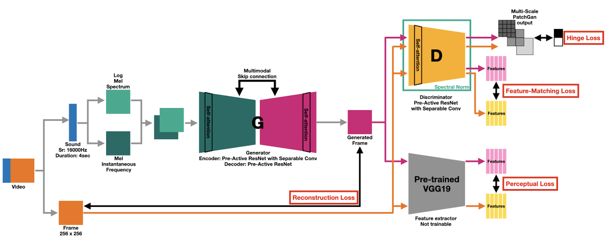

## Project1: Sound -> Image


`This project started with a motivation to build end-to-end model perform sound to image. Last contributions: https://openreview.net/forum?id=SJxJtiRqt7`


### Implementations

1. Model Structure
```
  - [x] implement spatial dropout
  - [-] implement U-net++ structure　---(PURGED)
   -> [x] implement partial skip connection between sound and image
  - [x] implement resnet block
  - [x] implement inverted residual block
  - [x] implement self-attention
  - [x] implement squeeze-exitation block
  - [x] implement handling spectal normalization
  - [x] implement normalizations
  - [x] implement batch-instance normalization
  - [x] implement spectral normalization
  - [x] implement "weights_init" to init VARIABLES
  - [x] implement WGAN-GP loss
  - [x] implement Hinge loss
  - [x] implement multi-scale perceptual loss
  - [x] implement multi-scale feature matching
  - [x] implement PatchGAN discriminator
  - [x] implement wide-domain-feature trainer with extra image data
```
2. Preprocessing
```
  - [x] SOUND:
    - [x] STFT handling
    - [x] Normalizer
  - [x] IMAGE: implement image Normalizer
```
3. DATASET
```
  - [x] video splitter
      - 1. extract frames, sound from video.
      - 2. parallelize
  - [x] sound and frame custom data loader for build datasets
  - [x] multiple audio files handle on stft
```
4. Training
```
  - [x] implement trainer
  - [x] implement save & load handler
```
5. Testing
```
  - [ ] LATER
```
6. Resouce handling
```
  - [x] CPUs or GPUs
```
7. cmds & others
```
  - [x] Define to use fire
  - [x] Define & Build docker image
```

### HOW TO RUN
1. Download video
```
python -m scripts.v000_video_download downloads --video_codes=<youtube video codes> --save_dir=<path_to_save>
```

2. Build dataset from video
```
python -m scripts.v001_dataset_builder video_to_datasets --video_path_dir=<video_path_dir> --file_filter="*" --offsets=[10] --save_dir="./dataset" --device="cpu" --start_index=0
```

3. Optional: build dataset from image and sounds
```
python -m scripts.v001_dataset_builder_v2 frame_n_audio_to_datasets --frame_path_dir=<fram_dir> --audio_path_dir=<audio_dir> --file_filter="*" --save_dir="./dataset" --device="cpu" --start_index=0
```

4. Optional: build audio labels using PANNs
```
python -m scripts.v002_generate_audio_labels generate --data_dir=<data_dir> batch_size=256 device="cuda", sr=16000)
```

5. Train the model

`Main structure`

```
ex)
python -m scripts.v003_sound2image train --data_dir '/workspace/codes/datasets/v002_combine_dataset/train' --test_data_dir '/workspace/codes/datasets/v002_combine_dataset/test' --extraimg_data_dir '/workspace/codes/rawdata/005_open_images_v6_resized' --extraimg_type 'jpg' --d_config '{"mel_normalizer_savefile": "/workspace/codes/exps/config/mel_normalizer.json"}' --m_config '{"batch_size": 256, "epochs": 500, "recon_lambda": 10.0, "fm_lambda": 0.0, "pl_lambda": 0.1, "g_ce_lambda": 0.1, "d_ce_lambda": 0.1, "extraimg_ratio": 0.1, "g_sn": False, "d_sn": True, "loss_type": "hinge", "g_norm": "BN", "flip": True, "dropout": 0.1, "load_strict": False}' --exp_dir '/workspace/codes/exps/v001/''
```

`Second structure`
```
ex)
python -m scripts.v003_sound2image_v2 train --data_dir '/workspace/codes/datasets/v002_combine_dataset/train' --test_data_dir '/workspace/codes/datasets/v002_combine_dataset/test'  --d_config '{"mel_normalizer_savefile": "/workspace/codes/exps/config/mel_normalizer.json"}' --m_config '{"batch_size": 256, "epochs": 500, "recon_lambda": 10.0, "recon_feat_lambda": 1.0, "g_sn": False, "d_sn": True, "loss_type": "hinge", "g_norm": "BIN", "flip": True, "dropout": 0.1, "load_strict": False}' --exp_dir '/workspace/codes/exps/v001/'
```
